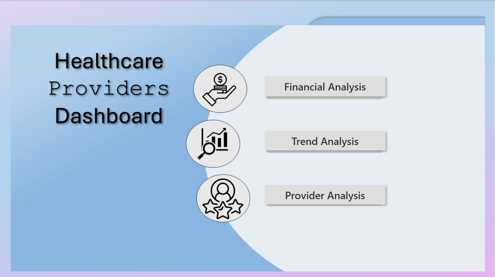
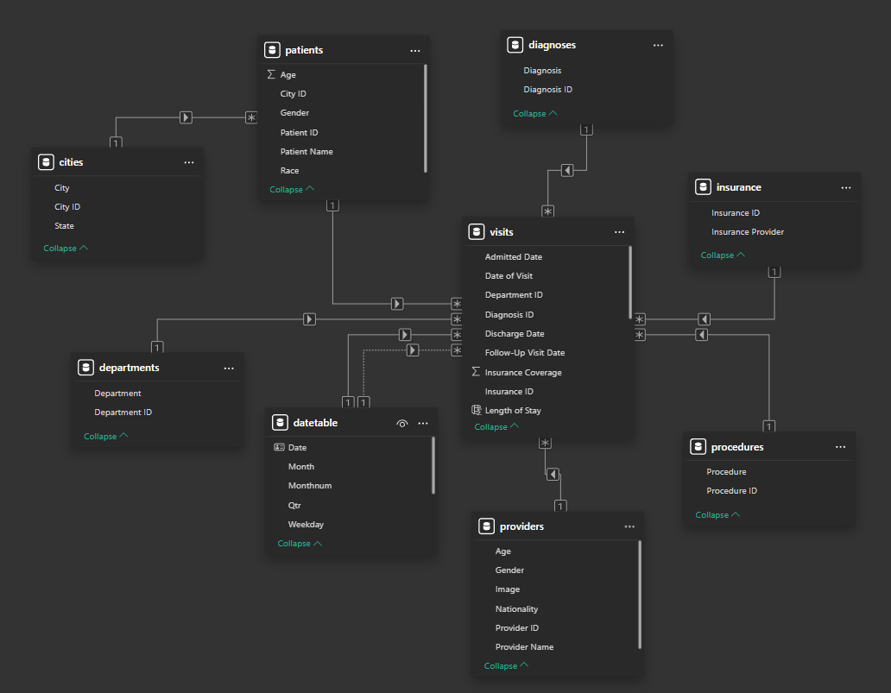
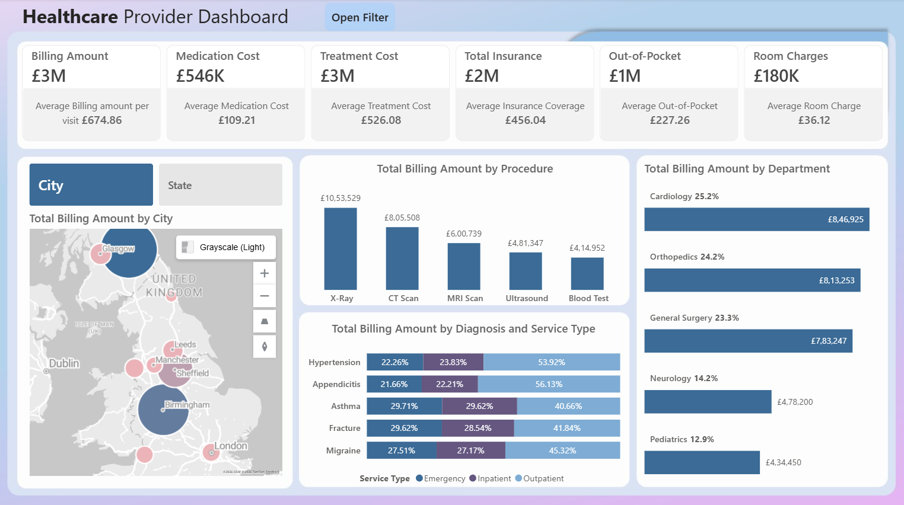
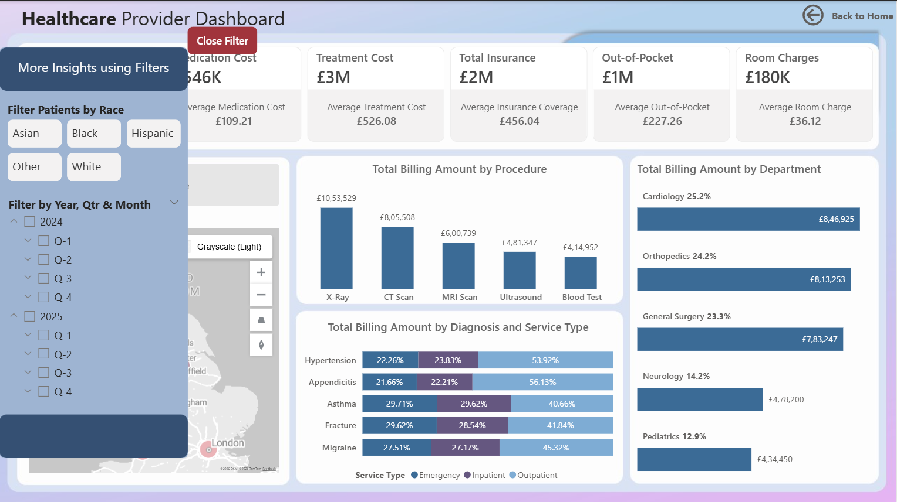
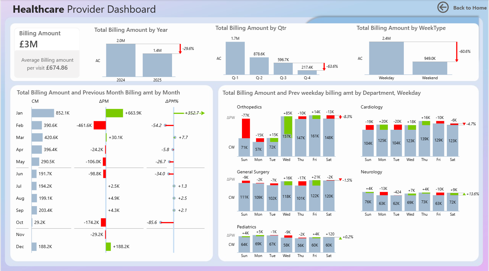
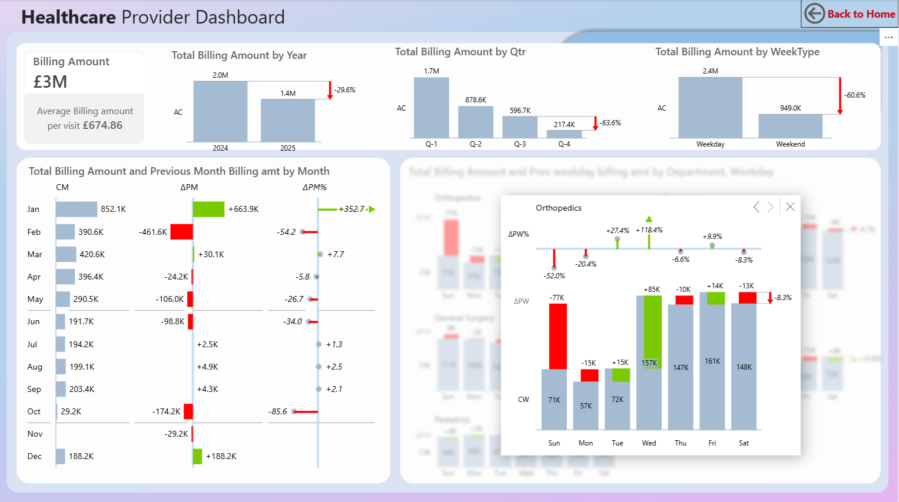
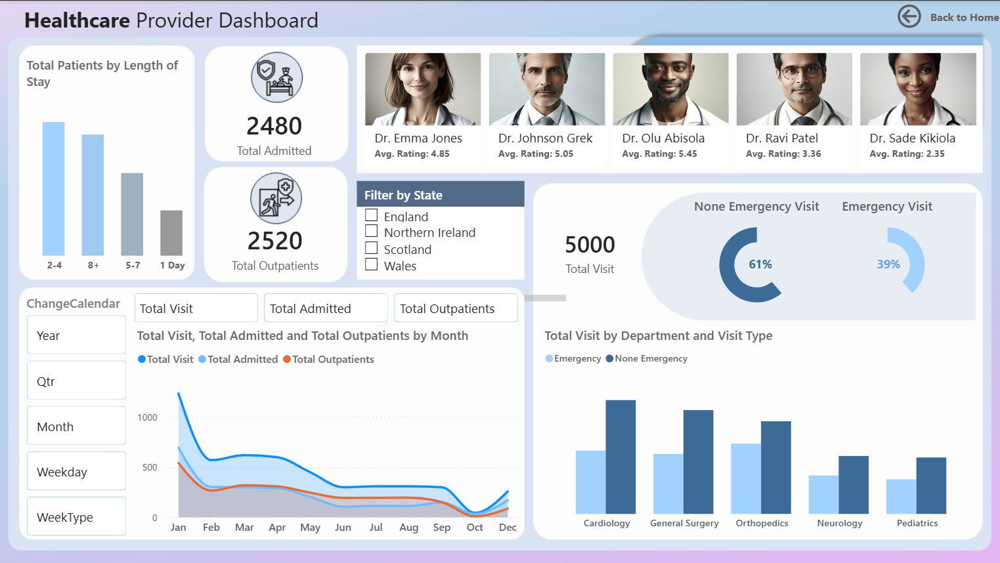
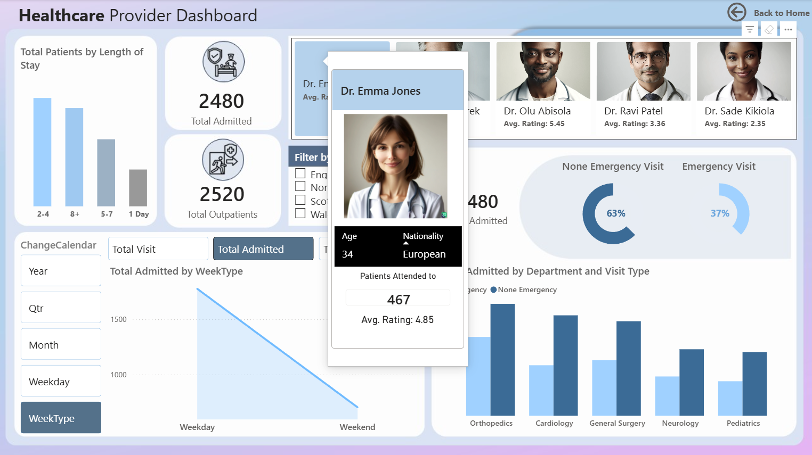

<h1 id="top">Healthcare Performance, Financial Insights & Provider Efficiency Using Power BI</h1>

This project develops a strategic Power BI dashboard enabling healthcare administrators and decision-makers to analyze patient trends, financial performance, and provider efficiency. The solution supports data-driven operational and strategic planning through interactive visuals, robust data modelling, and intuitive navigation.

<strong>Author:</strong> Ruchika Yadav 
<strong>Tools Used:</strong> Power BI (Power Query, Data Modelling, DAX, Visualization) 
<strong>LIVE Dashboard:</strong>
<a href="https://app.powerbi.com/view?r=eyJrIjoiNGFhMjkwM2MtNjEyYS00YWJlLTk1NWQtMTdkOTlhOTZhMjU4IiwidCI6ImNjN2FhMmYzLWMxNjktNGM1MS04NDZkLTdmMWY4MmRhZmMzYiJ9&pageName=c663806f86765ffaa91f" target="_blank">View Here</a>

<h2>📌 Table of Contents</h2>
<ol>
  <li><a href="#overview">Overview</a></li>
  <li><a href="#data-architecture">Data Architecture</a></li>
  <li><a href="#visualizations">Visualizations & Key Insights</a></li>
  <li><a href="#recommendations">Recommendations</a></li>
  <li><a href="#concepts">Key Concepts Demonstrated</a></li>
</ol>

<h2 id="overview">✨ Overview</h2>

<h3>🏥 Business Context</h3>

Healthcare systems generate large volumes of operational, financial, and provider-level data. Gaining visibility into patient flow, cost drivers, and departmental performance is essential for improving efficiency, managing capacity, and maintaining financial sustainability.

This project analyzes a UK healthcare provider dataset to uncover insights across:

<ul>
  <li>Patient visits, admissions, and length of stay</li>
  <li>Financial metrics including billing, insurance coverage, and out-of-pocket costs</li>
  <li>Departmental and provider-level performance</li>
  <li>Time-based and geographic demand patterns</li>
</ul>

The project emphasizes industry-aligned Power BI practices, including clean data modelling, DAX-driven metrics, interactivity, and user-focused dashboard design.

<h3>🎯 Project Objective</h3>
<ul>
  <li>Monitor overall system performance</li>
  <li>Identify key financial drivers and cost patterns</li>
  <li>Analyze patient trends and length-of-stay pressure</li>
  <li>Evaluate department and provider efficiency</li>
  <li>Explore geographic demand at state and city level</li>
</ul>

<strong>Interactive Power BI Dashboard:</strong>
<a href="https://app.powerbi.com/view?r=eyJrIjoiNGFhMjkwM2MtNjEyYS00YWJlLTk1NWQtMTdkOTlhOTZhMjU4IiwidCI6ImNjN2FhMmYzLWMxNjktNGM1MS04NDZkLTdmMWY4MmRhZmMzYiJ9&pageName=c663806f86765ffaa91f" target="_blank">View Here</a>

<h2 id="data-architecture">📂 Data Architecture</h2>

<strong>Schema:</strong> Star schema

<h3>Tables Used</h3>

<h4>1️⃣ Fact Table</h4>

  

  
<strong>Visits</strong> – click to expand table details

   

  <table width="100%">
    <thead>
      <tr style="background-color:#2f2f2f; color:white;">
        <th align="left">Column Name</th>
        <th align="left">Description</th>
      </tr>
    </thead>
    <tbody>
      <tr style="background-color:#f2f2f2;">
        <td>Date of Visit</td>
        <td>Date on which the patient visit occurred.</td>
      </tr>
      <tr style="background-color:#e0e0e0;">
        <td>Patient ID</td>
        <td>Unique identifier for each patient.</td>
      </tr>
      <tr style="background-color:#f2f2f2;">
        <td>Provider ID</td>
        <td>Unique identifier for the healthcare provider or doctor consulted.</td>
      </tr>
      <tr style="background-color:#e0e0e0;">
        <td>Department ID</td>
        <td>Identifier for the department responsible for the visit (e.g., Orthopaedics, Cardiology).</td>
      </tr>
      <tr style="background-color:#f2f2f2;">
        <td>Diagnosis ID</td>
        <td>Identifier for the primary diagnosis associated with the visit.</td>
      </tr>
      <tr style="background-color:#e0e0e0;">
        <td>Procedure ID</td>
        <td>Identifier for the medical procedure performed during the visit.</td>
      </tr>
      <tr style="background-color:#f2f2f2;">
        <td>Insurance ID</td>
        <td>Identifier linking the visit to the patient’s insurance coverage.</td>
      </tr>
      <tr style="background-color:#e0e0e0;">
        <td>Service Type</td>
        <td>Type of service delivered: Emergency, Inpatient, or Outpatient.</td>
      </tr>
      <tr style="background-color:#f2f2f2;">
        <td>Treatment Cost</td>
        <td>Cost incurred for medical treatment provided during the visit.</td>
      </tr>
      <tr style="background-color:#e0e0e0;">
        <td>Medication Cost</td>
        <td>Total cost of medications prescribed or administered.</td>
      </tr>
      <tr style="background-color:#f2f2f2;">
        <td>Follow-up Visit Date</td>
        <td>Scheduled date for the patient’s follow-up visit, if applicable.</td>
      </tr>
      <tr style="background-color:#e0e0e0;">
        <td>Patient Satisfaction Score</td>
        <td>Numeric score representing patient-reported satisfaction with the visit.</td>
      </tr>
      <tr style="background-color:#f2f2f2;">
        <td>Referral Source</td>
        <td>Source through which the patient was referred (e.g., self, physician, external).</td>
      </tr>
      <tr style="background-color:#e0e0e0;">
        <td>Visit Type</td>
        <td>Classification of visit based on urgency or admission status.</td>
      </tr>
      <tr style="background-color:#f2f2f2;">
        <td>Payment Status</td>
        <td>Status of payment for the visit (e.g., paid, pending, partially paid).</td>
      </tr>
      <tr style="background-color:#e0e0e0;">
        <td>Discharge Date</td>
        <td>Date on which the patient was discharged from care.</td>
      </tr>
      <tr style="background-color:#f2f2f2;">
        <td>Admitted Date</td>
        <td>Date on which the patient was admitted for inpatient care.</td>
      </tr>
      <tr style="background-color:#e0e0e0;">
        <td>Room Type</td>
        <td>Type of room assigned during inpatient stay.</td>
      </tr>
      <tr style="background-color:#f2f2f2;">
        <td>Insurance Coverage</td>
        <td>Amount covered by insurance for the visit.</td>
      </tr>
      <tr style="background-color:#e0e0e0;">
        <td>Room Charges</td>
        <td>Charges associated with room usage during inpatient stay.</td>
      </tr>
      <tr style="background-color:#f2f2f2;">
        <td>Length of Stay</td>
        <td>Total duration of inpatient stay, calculated in days.</td>
      </tr>
    </tbody>
  </table>
  
  

<h4>2️⃣ Dimension Tables</h4>

  
<strong>Patients</strong> – click to expand table details

   

  <table width="100%">
    <thead>
      <tr style="background-color:#2f2f2f; color:white;">
        <th align="left">Column Name</th>
        <th align="left">Description</th>
      </tr>
    </thead>
    <tbody>
      <tr style="background-color:#f2f2f2;">
        <td>Patient ID</td>
        <td>Unique identifier for each patient.</td>
      </tr>
      <tr style="background-color:#e0e0e0;">
        <td>Patient Name</td>
        <td>Name of the patient (synthetic/anonymized).</td>
      </tr>
      <tr style="background-color:#f2f2f2;">
        <td>Age</td>
        <td>Age of the patient at the time of visit.</td>
      </tr>
      <tr style="background-color:#e0e0e0;">
        <td>Gender</td>
        <td>Gender of the patient.</td>
      </tr>
      <tr style="background-color:#f2f2f2;">
        <td>Race</td>
        <td>Self-reported race or ethnicity category.</td>
      </tr>
      <tr style="background-color:#e0e0e0;">
        <td>City ID</td>
        <td>Reference to the city where the patient resides.</td>
      </tr>
    </tbody>
  </table>

  
<strong>Providers</strong> – click to expand table details

   

  <table width="100%">
    <thead>
      <tr style="background-color:#2f2f2f; color:white;">
        <th align="left">Column Name</th>
        <th align="left">Description</th>
      </tr>
    </thead>
    <tbody>
      <tr style="background-color:#f2f2f2;">
        <td>Provider ID</td>
        <td>Unique identifier for each healthcare provider.</td>
      </tr>
      <tr style="background-color:#e0e0e0;">
        <td>Provider Name</td>
        <td>Name of the doctor or healthcare professional.</td>
      </tr>
      <tr style="background-color:#f2f2f2;">
        <td>Age</td>
        <td>Age of the healthcare provider.</td>
      </tr>
      <tr style="background-color:#e0e0e0;">
        <td>Gender</td>
        <td>Gender of the healthcare provider.</td>
      </tr>
      <tr style="background-color:#f2f2f2;">
        <td>Nationality</td>
        <td>Nationality of the healthcare provider.</td>
      </tr>
      <tr style="background-color:#e0e0e0;">
        <td>Image</td>
        <td>Public image URL used for visual identification in reports and tooltips.</td>
      </tr>
    </tbody>
  </table>

  
<strong>Departments</strong> – click to expand table details

   

  <table width="100%">
    <thead>
      <tr style="background-color:#2f2f2f; color:white;">
        <th align="left">Column Name</th>
        <th align="left">Description</th>
      </tr>
    </thead>
    <tbody>
      <tr style="background-color:#f2f2f2;">
        <td>Department ID</td>
        <td>Unique identifier for each hospital department.</td>
      </tr>
      <tr style="background-color:#e0e0e0;">
        <td>Department</td>
        <td>Name of the department providing care (e.g., Orthopaedics, Cardiology).</td>
      </tr>
    </tbody>
  </table>

  
<strong>Cities</strong> – click to expand table details

   

  <table width="100%">
    <thead>
      <tr style="background-color:#2f2f2f; color:white;">
        <th align="left">Column Name</th>
        <th align="left">Description</th>
      </tr>
    </thead>
    <tbody>
      <tr style="background-color:#f2f2f2;">
        <td>City ID</td>
        <td>Unique identifier for each city.</td>
      </tr>
      <tr style="background-color:#e0e0e0;">
        <td>City</td>
        <td>Name of the city where the healthcare facility or patient is located.</td>
      </tr>
      <tr style="background-color:#f2f2f2;">
        <td>State</td>
        <td>State or region associated with the city.</td>
      </tr>
    </tbody>
  </table>

  
<strong>Procedures</strong> – click to expand table details

   

  <table width="100%">
    <thead>
      <tr style="background-color:#2f2f2f; color:white;">
        <th align="left">Column Name</th>
        <th align="left">Description</th>
      </tr>
    </thead>
    <tbody>
      <tr style="background-color:#f2f2f2;">
        <td>Procedure ID</td>
        <td>Unique identifier for each medical procedure.</td>
      </tr>
      <tr style="background-color:#e0e0e0;">
        <td>Procedure</td>
        <td>Name or description of the procedure performed.</td>
      </tr>
    </tbody>
  </table>

  
<strong>Diagnoses</strong> – click to expand table details

   

  <table width="100%">
    <thead>
      <tr style="background-color:#2f2f2f; color:white;">
        <th align="left">Column Name</th>
        <th align="left">Description</th>
      </tr>
    </thead>
    <tbody>
      <tr style="background-color:#f2f2f2;">
        <td>Diagnosis ID</td>
        <td>Unique identifier for each medical diagnosis.</td>
      </tr>
      <tr style="background-color:#e0e0e0;">
        <td>Diagnosis</td>
        <td>Name or classification of the medical condition diagnosed.</td>
      </tr>
    </tbody>
  </table>

  
<strong>Date Table</strong> – click to expand table details

   

  <table width="100%">
    <thead>
      <tr style="background-color:#2f2f2f; color:white;">
        <th align="left">Column Name</th>
        <th align="left">Description</th>
      </tr>
    </thead>
    <tbody>
      <tr style="background-color:#f2f2f2;">
        <td>Date</td>
        <td>Calendar date used for time-based analysis; linked to the Date of Visit in the Visits fact table.</td>
      </tr>
      <tr style="background-color:#e0e0e0;">
        <td>Year</td>
        <td>Calendar year extracted from the date, used for yearly trend analysis.</td>
      </tr>
      <tr style="background-color:#f2f2f2;">
        <td>Month</td>
        <td>Full month name derived from the date (e.g., January, February).</td>
      </tr>
      <tr style="background-color:#e0e0e0;">
        <td>Month Num</td>
        <td>Numeric representation of the month (1–12), used for correct chronological sorting.</td>
      </tr>
      <tr style="background-color:#f2f2f2;">
        <td>Week Day</td>
        <td>Name of the weekday (Monday–Sunday) for daily and operational pattern analysis.</td>
      </tr>
      <tr style="background-color:#e0e0e0;">
        <td>Week Num</td>
        <td>Week number of the year, supporting week-over-week trend comparisons.</td>
      </tr>
      <tr style="background-color:#f2f2f2;">
        <td>QTR</td>
        <td>Quarter of the year (Q1–Q4), used for quarterly performance analysis.</td>
      </tr>
      <tr style="background-color:#e0e0e0;">
        <td>Week Type</td>
        <td>Categorical flag identifying Weekday or Weekend, used to analyze operational demand patterns.</td>
      </tr>
    </tbody>
  </table>

  
<strong>Insurance</strong> – click to expand table details

   

  <table width="100%">
    <thead>
      <tr style="background-color:#2f2f2f; color:white;">
        <th align="left">Column Name</th>
        <th align="left">Description</th>
      </tr>
    </thead>
    <tbody>
      <tr style="background-color:#f2f2f2;">
        <td>Insurance ID</td>
        <td>Unique identifier for the insurance record.</td>
      </tr>
      <tr style="background-color:#e0e0e0;">
        <td>Insurance Provider</td>
        <td>Name of the insurance provider covering the patient.</td>
      </tr>
    </tbody>
  </table>

<em>Data Model </em>

The Visits table serves as the central fact table with one-to-many relationships to all dimensions.  
The Date table enables standardized time intelligence and filtering.

<h2 id="visualizations">📊 Visualizations & Key Insights</h2>

<h3>I. Financial Analysis Dashboard</h3>

<h4>🔎 Key Insights</h4>
<ul>
  <li>
    Treatment and billing are the primary cost drivers, each contributing approximately <strong>£3.0M</strong>, with average per-visit costs of <strong>£526.08</strong> and <strong>£674.86</strong> respectively. Room charges, while smaller in total, increased sharply (<strong>£12.73 → £72.18</strong>), indicating rising care intensity.
  </li>
  <li>
    Service utilization shifted over time. Care was predominantly outpatient-led in 2024 but became evenly distributed across Emergency, Inpatient, and Outpatient services (<strong>~33–35%</strong> each) in 2025, reflecting increased acuity.
  </li>
  <li>
    Average length of stay increased in 2025, directly contributing to higher room charges and greater inpatient pressure, despite 2025 representing partial-year data.
  </li>
  <li>
    Departmental contribution changed meaningfully: <strong>Cardiology</strong> led billing in 2024 (<strong>25.2%</strong>), while <strong>Orthopaedics</strong> became the dominant contributor in 2025 (<strong>~40.3%</strong>).
  </li>
  <li>
    Billing is geographically concentrated. <strong>Edinburgh</strong> and <strong>Birmingham</strong> generate the highest city-level billing, while <strong>Wales</strong> leads at the state level; <strong>Scotland</strong> records the lowest billing.
  </li>
  <li>
    Diagnostic imaging (<strong>X-rays ~£1.05M</strong>) contributes disproportionately to revenue compared to routine diagnostics such as blood tests (<strong>~£415K</strong>).
  </li>
</ul>

<strong>🔑 Executive Takeaway:</strong> 
<em>Financial performance reflects a shift from volume-driven outpatient care toward fewer, more cost-intensive encounters, driven by longer stays, higher acuity, and a changing service mix.</em>

<h3>II. Trend Analysis Dashboard</h3>

<h4>🔎 Key Insights</h4>
<ul>
  <li>
    Total billing declined by <strong>29.6%</strong> in 2025 compared to 2024, primarily due to partial-year data coverage rather than a sustained reduction in activity.
  </li>
  <li>
    Strong seasonality is evident in 2024, with a sharp <strong>63.6%</strong> drop in billing from <strong>Q3 to Q4</strong>.
  </li>
  <li>
    Healthcare activity is strongly weekday-driven. Across all months, weekend billing is consistently <strong>~60%</strong> lower than weekday activity.
  </li>
  <li>
    Monthly billing exhibits high volatility rather than steady growth.
    <ul>
      <li>
        <strong>January 2025</strong> recorded a <strong>244%</strong> increase, driven almost entirely by Orthopaedics.
      </li>
      <li>
        <strong>October 2024</strong> experienced the steepest decline (<strong>–85.6%</strong>), reflecting a short-term contraction rather than a persistent downturn.
      </li>
    </ul>
  </li>
  <li>
    Orthopaedics shows the highest volatility, with pronounced midweek surges (up to <strong>+118.4%</strong> on Wednesdays) and clear weekend declines.
  </li>
  <li>
    Cardiology and General Surgery consistently decline on weekends, aligning with scheduled and elective care patterns.
  </li>
  <li>
    Neurology and Paediatrics remain comparatively stable, indicating a higher share of non-deferrable care. Paediatrics is the most stable department overall.
  </li>
</ul>

<strong>🔑 Executive Takeaway:</strong> 
<em>Healthcare activity is shaped by timing and departmental behavior. Seasonal effects, weekday dependence, and volatility in surgical specialties contrast with the stability of Paediatrics, reinforcing reliance on weekday-driven operations rather than uniform demand.</em>

<h3>III. Provider Analysis Dashboard</h3>

<h4>🔎 Key Insights</h4>
<ul>
  <li>
    Admissions peaked in <strong>January 2025</strong>, marking the period of highest inpatient pressure, driven primarily by Orthopaedics.
  </li>
  <li>
    Orthopaedics is the most high-acuity department, leading in admissions (<strong>680</strong>), emergency share (<strong>43%</strong>), and long hospital stays (<strong>126</strong> patients with 8+ days). It is the primary driver of bed utilization.
  </li>
  <li>
    Cardiology manages the highest overall patient volume (<strong>1,281 visits</strong>) but remains largely outpatient-oriented with controlled admissions and fewer extended stays.
  </li>
  <li>
    General Surgery is admission-heavy, with minimal same-day discharges and moderate long stays, reflecting planned inpatient recovery rather than emergency-driven demand.
  </li>
  <li>
    Neurology exhibits mixed acuity, balancing urgent short stays with complex prolonged cases (<strong>40%</strong> emergency visits).
  </li>
  <li>
    Paediatrics demonstrates the most stable care pattern, with lower volumes and balanced length-of-stay distribution, contributing minimal strain on system capacity.
  </li>
  <li>
    Emergency-driven admissions are concentrated at the provider level. <strong>Dr. Sade Kikiola</strong> manages the highest volume of emergency admissions, indicating specialization in high-acuity care rather than uneven workload distribution.
  </li>
  <li>
    Length-of-stay pressure is uneven across departments, with prolonged hospitalizations concentrated mainly in Orthopaedics and select inpatient services, confirming that system strain is driven by care complexity rather than visit volume.
  </li>
</ul>

<h2 id="recommendations">🚀 Recommendations</h2>

<table>
  <thead>
    <tr style="background-color:#2f2f2f; color:white;">
      <th align="left">Area</th>
      <th align="left">Recommendation</th>
    </tr>
  </thead>
  <tbody>
    <tr style="background-color:#f2f2f2;">
      <td><strong>Financial Monitoring</strong></td>
      <td>
        Control treatment-driven costs and high-cost diagnoses while improving insurance alignment to limit rising per-visit out-of-pocket burden.
      </td>
    </tr>
    <tr style="background-color:#e0e0e0;">
      <td><strong>Emergency Services</strong></td>
      <td>
        Prioritize staffing and capacity in high-acuity departments, particularly Orthopaedics, where emergency admissions and long hospital stays are concentrated.
      </td>
    </tr>
    <tr style="background-color:#f2f2f2;">
      <td><strong>Provider Performance</strong></td>
      <td>
        Support provider specialization and balance workloads within high-acuity departments rather than relying on volume-based comparisons.
      </td>
    </tr>
    <tr style="background-color:#e0e0e0;">
      <td><strong>Operations</strong></td>
      <td>
        Align staffing with weekday-dominant demand and use flexible scheduling to manage department-driven volatility, especially in Orthopaedics.
      </td>
    </tr>
    <tr style="background-color:#f2f2f2;">
      <td><strong>Geographic Strategy</strong></td>
      <td>
        Allocate resources toward high-billing regions while reassessing service coverage and demand strategies in lower-demand areas.
      </td>
    </tr>
    <tr style="background-color:#e0e0e0;">
      <td><strong>Patient Flow</strong></td>
      <td>
        Reduce prolonged hospital stays by strengthening discharge planning and post-acute care coordination in departments with high length-of-stay pressure.
      </td>
    </tr>
    <tr style="background-color:#f2f2f2;">
      <td><strong>Decision Support</strong></td>
      <td>
        Enable rapid multi-dimensional performance analysis using dynamic parameters and interactive filters.
      </td>
    </tr>
  </tbody>
</table>

<h2 id="concepts">🧠 Key Concepts Demonstrated</h2>
<ul>
  <li>Data modelling</li>
  <li>Date dimensions & time intelligence</li>
  <li>Dynamic visuals using field parameters</li>
  <li>Cross-filtering & interaction control</li>
  <li>Bookmark-driven navigation and UI design</li>
  <li>KPI formatting and dashboard polish</li>
</ul>

<strong>Notes:</strong> Dataset is synthetic and anonymized. No real patient-identifiable information is included.

<strong>Learning Reference:</strong> Data With Decision

<a href="#top">⬆ Back to Top</a>

